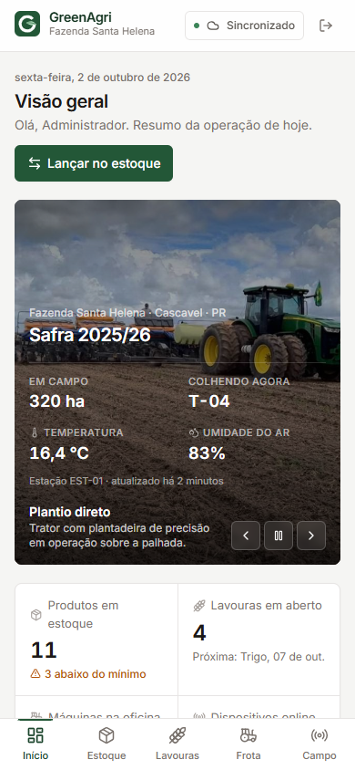
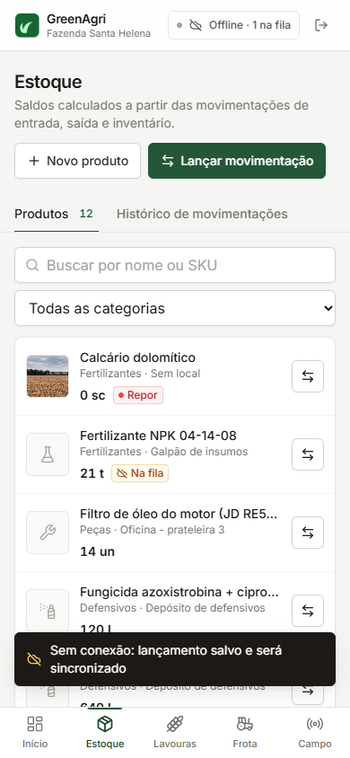
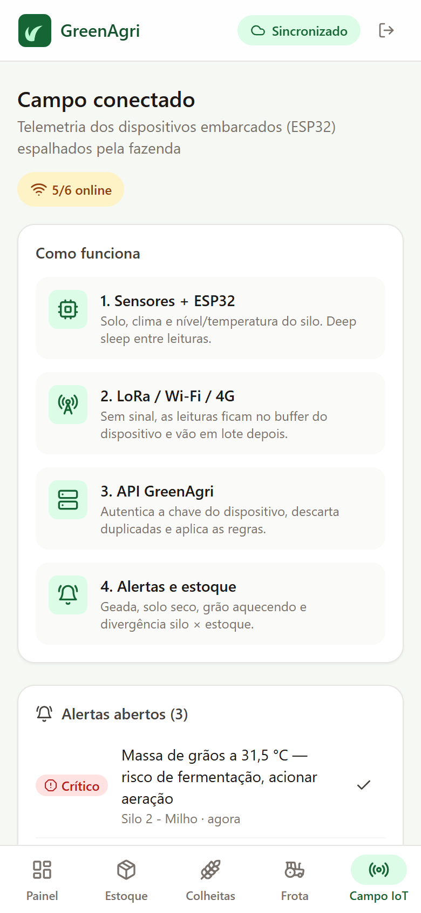
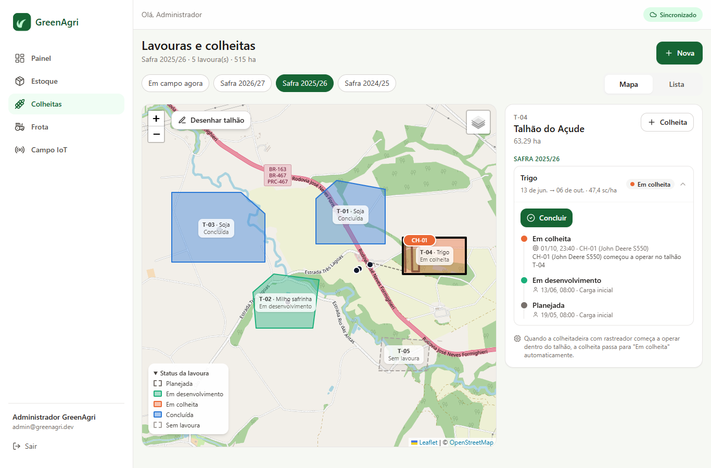
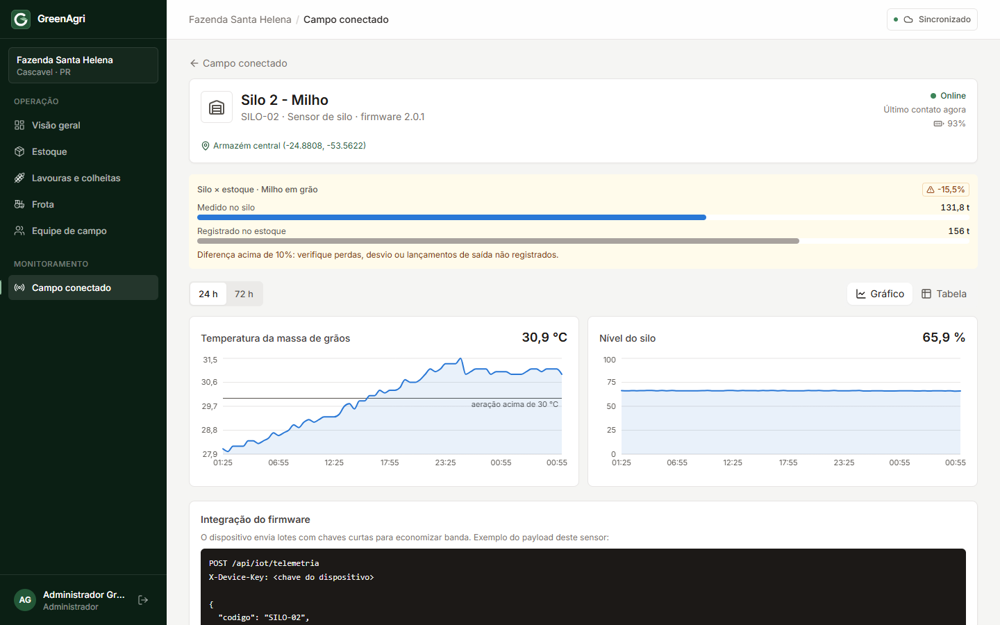
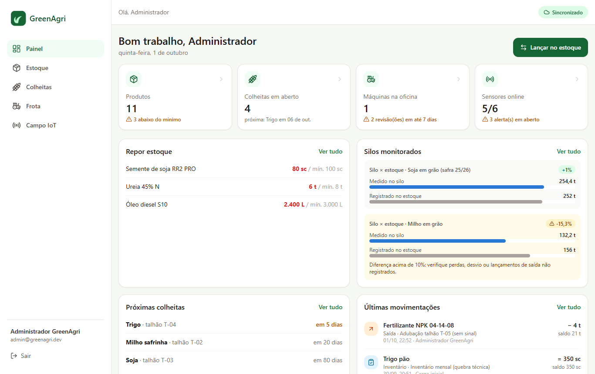

# 🌱 GreenAgri

**Gestão da fazenda no celular, inclusive sem sinal.** Controle o estoque de grãos e insumos, acompanhe as colheitas por talhão, organize a frota e receba alertas dos sensores instalados no campo, tudo num só app.

<p align="center">
  
  
  
</p>

---

## O que dá para fazer

### 📦 Estoque
- Veja o saldo de cada produto (sacas, toneladas, litros, kg ou unidades) e quanto falta para o **estoque mínimo**.
- Registre **entradas** (compras, colheita), **saídas** (vendas, plantio, abastecimento) e **inventários** (contagem física).
- O app **não deixa a saída passar do que existe**: se faltar produto, ele avisa antes de salvar.
- Cada produto tem um **histórico completo**: quem lançou, quando e por quê.

### 🗺️ Lavouras no mapa
- Veja **todos os talhões da fazenda no mapa**, cada um colorido pela situação da lavoura: *planejada*, *em desenvolvimento*, *em colheita* ou *concluída*.
- Use **Em campo agora** para ver o que ocupa cada talhão hoje, ou escolha uma **safra** (2024/25, 2025/26…) para ver as áreas e a rotação de culturas daquele ano.
- Toque em um talhão para ver a lavoura, o histórico de mudanças de status e as safras anteriores.
- **Desenhe um talhão novo** tocando os cantos dele no mapa. A área em hectares é calculada na hora.
- Alterne entre **mapa** (OpenStreetMap, gratuito) e **satélite**.
- Os sensores e a colheitadeira (com o caminho que fez) aparecem no mapa.

<p align="center">
  
</p>

### 🌾 Colheitas
- Cadastre cada lavoura num talhão: cultura, safra, data de plantio e previsão de colheita.
- Avance a situação com um toque (*Registrar plantio* → *Iniciar colheita* → *Concluir*). Tudo fica no histórico, com quem fez e quando.
- **A colheita começa sozinha:** quando a colheitadeira com rastreador liga a plataforma dentro do talhão, o app marca a lavoura como *em colheita*.
- O app não deixa plantar duas lavouras ao mesmo tempo no mesmo talhão.
- Acompanhe quanto falta para colher e a produtividade em **sacas por hectare**.
- Ao **concluir** uma colheita, a produção **entra sozinha no estoque** do produto escolhido.

### 🚜 Frota
- Tratores, colheitadeiras, pulverizadores, caminhões e utilitários num só lugar.
- Atualize o horímetro (ou o odômetro) e a data da próxima revisão. O app destaca as revisões que vencem em até 7 dias.

### 📡 Campo IoT
- Veja em tempo real os sensores da fazenda: **estação meteorológica**, **umidade do solo** nos talhões, **nível e temperatura dos silos** e o **rastreador da colheitadeira** (posição, velocidade e trajeto).
- Receba alertas de **risco de geada**, **solo seco** (hora de irrigar), **grão aquecendo no silo** (acionar aeração) e **bateria fraca**.
- **Silo × estoque**: o app compara o grão que o sensor mede dentro do silo com o que está lançado no estoque e avisa quando a diferença passa de 10%. Assim dá para descobrir perdas ou saídas que ninguém registrou.

<p align="center">
  
</p>

---

## Funciona sem internet

O GreenAgri foi feito para quem trabalha onde o sinal cai.

1. **Abra o app pelo menos uma vez com internet.** Ele guarda as telas e os últimos dados no aparelho.
2. **Sem sinal, continue usando normalmente.** O selo no topo mostra **Offline** e quantos lançamentos estão esperando.
3. **Os lançamentos ficam salvos no aparelho** e o saldo na tela já considera o que você lançou (com o aviso *não sincronizado*).
4. **Quando o sinal volta, tudo é enviado sozinho**, na ordem em que foi feito. Não precisa repetir nada, e nada é lançado em dobro.

Se o servidor recusar algum lançamento (por exemplo, uma saída maior que o saldo real), ele aparece em **Sincronização**, com o motivo. Ali você pode tentar de novo ou descartar.

> Dica: sair da conta apaga os dados guardados no aparelho. Se houver lançamentos na fila, o app avisa antes.

## Instale na tela inicial

O GreenAgri é um app web instalável (PWA), sem precisar de loja de aplicativos:

- **Android (Chrome):** menu ⋮ → *Instalar app* ou *Adicionar à tela inicial*.
- **iPhone (Safari):** botão Compartilhar → *Adicionar à Tela de Início*.
- **Computador (Chrome/Edge):** ícone de instalação na barra de endereço.

## Acesso de demonstração

| Perfil | E-mail | Senha | O que pode fazer |
|---|---|---|---|
| Administrador | `admin@greenagri.dev` | `greenagri123` | Tudo, inclusive excluir produtos e cadastrar sensores |
| Operador | `operador@greenagri.dev` | `greenagri123` | Lançamentos, colheitas e frota |

Também é possível criar uma conta nova pela tela de login (perfil Operador).

A demonstração vem com uma fazenda fictícia perto de Cascavel (PR): 11 produtos, 13 movimentações, 5 talhões desenhados no mapa com 3 safras de histórico, 6 máquinas e 7 dispositivos com 3 dias de leituras. Um dos silos tem uma divergência proposital para mostrar o alerta.

**Para ver a colheita começar sozinha:** abra *Colheitas → Mapa*, rode o simulador (passo 3 abaixo) e aguarde cerca de 1 minuto. A colheitadeira sai do galpão e entra no talhão T-04, que muda de *em desenvolvimento* para *em colheita*.

---

## Como executar

Precisa de **Java 21+** e **Node 18+**.

```bash
# 1. API (http://localhost:8080)
cd backend
./mvnw spring-boot:run        # no Windows: mvnw.cmd spring-boot:run

# 2. App (http://localhost:5173), em outro terminal
cd frontend
npm install
npm run dev

# 3. Opcional: sensores e colheitadeira simulados enviando dados ao vivo
node firmware/simulador/simulador.mjs
```

Ou tudo com Docker (PostgreSQL + API + app em http://localhost:8081):

```bash
docker compose up --build
```

## Para desenvolvedores

| Documento | Conteúdo |
|---|---|
| [docs/DESENVOLVIMENTO.md](docs/DESENVOLVIMENTO.md) | Estrutura, regras de negócio, endpoints, testes e como funciona o modo offline |
| [docs/SISTEMA-EMBARCADO.md](docs/SISTEMA-EMBARCADO.md) | Firmware ESP32, rastreador com geofence de talhões, protocolo de telemetria, hardware, consumo e roadmap |
| [firmware/README.md](firmware/README.md) | Como gravar o firmware e usar o simulador |
| Swagger | http://localhost:8080/swagger-ui.html com a API rodando |

**Tecnologias:** Java 21 · Spring Boot 3.5 · Spring Security (JWT) · JPA · Flyway · PostgreSQL/H2 · React 18 · TypeScript · Vite · Tailwind CSS · TanStack Query · IndexedDB (Dexie) · Workbox (PWA) · Recharts · Leaflet + OpenStreetMap · ESP32 + GNSS (C++/PlatformIO) · Docker · GitHub Actions

<p align="center">
  
</p>
