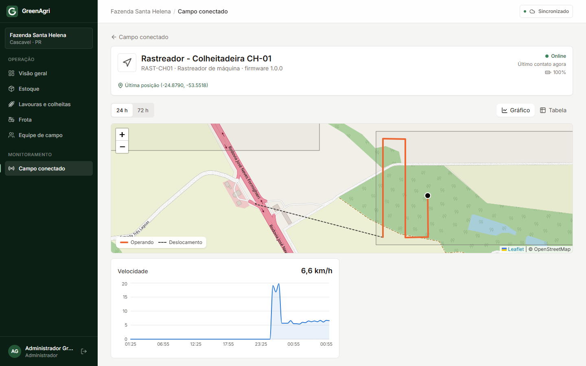

# Campo Conectado — sistema embarcado do GreenAgri

A área **Campo IoT** do GreenAgri liga o sistema de gestão a dispositivos instalados na fazenda: estação meteorológica, sensores de umidade do solo nos talhões, sensores de nível e temperatura nos silos e um rastreador GNSS na colheitadeira. Ela foi pensada para mostrar, num projeto só, as competências que vagas de sistemas embarcados no agro pedem: firmware de baixo consumo, comunicação em campo com sinal ruim, protocolo de dados enxuto e integração com o negócio (estoque e produção).

## O problema que resolve

| Dor no campo | O que o sistema faz |
|---|---|
| Geada destrói a lavoura numa madrugada | A estação mede a temperatura e alerta abaixo de 3 °C |
| Irrigação no "achismo" desperdiça água e energia | O sensor de solo alerta abaixo de 25% de umidade volumétrica |
| Grão armazenado esquenta, fermenta e perde valor | O cabo termométrico do silo alerta acima de 30 °C (acionar aeração) |
| O estoque do sistema não bate com o silo | O nível medido é convertido em kg e comparado com o saldo registrado |
| Sinal de celular/Wi-Fi intermitente no talhão | O firmware guarda as leituras e envia em lote quando o sinal volta |
| Ninguém atualiza o sistema quando a colheita começa | O rastreador da colheitadeira detecta a máquina trabalhando dentro do talhão e muda o status sozinho |

Dois recursos se destacam:

- **Reconciliação silo × estoque.** O sensor ultrassônico mede o nível, o backend converte para kg usando a capacidade do silo e compara com o saldo do produto vinculado. Uma diferença acima de 10% aparece no painel. Ela indica perda, desvio ou uma saída que ninguém lançou. Nos dados de demonstração, o Silo 2 mostra −15%.
- **Geofence de talhões.** Cada talhão é um polígono desenhado no mapa. Quando a colheitadeira envia posições com a plataforma de corte ligada dentro de um talhão com lavoura em desenvolvimento, a colheita passa para **"Em colheita"**. A mudança fica no histórico com a origem *dispositivo*, o horário e o ponto do GPS.

## Rastreador de máquina + geofence

<p align="center"></p>

**Hardware:** ESP32 + receptor GNSS (NEO-6M ou NEO-M8N) + entrada digital isolada por optoacoplador. A entrada recebe o sinal da plataforma de corte, vindo de um sensor indutivo no eixo ou da saída do controlador da máquina. A placa é alimentada pelos 12 V da máquina através de um regulador buck, então não precisa de deep sleep.

**Firmware** (`firmware/esp32-sensor/src/rastreador.cpp`, ambiente `pio run -e rastreador`):

- **Taxa adaptativa:** um ponto a cada 15 s operando, 60 s em deslocamento e 5 min parada.
- **Envio por evento:** ligar ou desligar a plataforma gera um ponto e um envio imediatos, porque é o evento que o geofence procura.
- **Horário do próprio GNSS (UTC)**, sem depender de NTP no campo.
- **Buffer de 400 pontos** (~1h40 operando sem sinal), esvaziado em lotes de 50 quando a conexão volta.
- **Debounce** da entrada da plataforma (maioria em 5 leituras).

**Backend** (`GeofenceService`):

1. Para cada lote, percorre as leituras em ordem cronológica.
2. Uma leitura com `op: true` e posição válida é testada contra os polígonos dos talhões (*ray casting* em `Poligono.contem`).
3. Se o talhão tem lavoura **em desenvolvimento**, ela passa para **em colheita**. O evento usa o horário e o ponto da **primeira** leitura dentro do talhão, então um lote atrasado (store-and-forward) mantém o horário real.
4. O status nunca volta e cada talhão é processado uma vez por lote, então reenvios não geram eventos duplicados.
5. Uma máquina "disponível" que começa a operar passa a "em operação" na **Frota**.
6. Receptores sem fix costumam enviar `0,0`. Essas leituras são tratadas como posição desconhecida.

**Protocolo:** o mesmo lote das demais leituras, com `lat`, `lon`, `vel` (km/h) e `op` (implemento operando):

```json
{ "codigo": "RAST-CH01", "leituras": [ { "ts": 1790902401, "lat": -24.87861, "lon": -53.54892, "vel": 6.5, "op": true } ] }
```

**Mapa (Leaflet + OpenStreetMap, gratuito e sem chave de API):**

- Talhões coloridos pelo status da lavoura, com rótulo por extenso (a cor nunca é a única pista).
- Filtro **Em campo agora** / **por safra** para separar as áreas de cada ano-safra e a rotação de culturas (ex.: soja → milho safrinha no T-02).
- Sensores e máquinas como camadas que podem ser ligadas e desligadas. A colheitadeira aparece com o trajeto das últimas 3 h, e os trechos operando ficam destacados.
- Desenho de talhão novo tocando os vértices no mapa, com a área calculada na hora (a mesma conta do backend).
- Camada de satélite opcional (Esri World Imagery). Verifique os termos de uso da Esri antes de usar comercialmente.
- Imagens do mapa já vistas ficam em cache no service worker. Respeitando a [política de uso do OpenStreetMap](https://operations.osmfoundation.org/policies/tiles/), não há pré-download em massa.

## Arquitetura

```
 ┌──────────────┐  deep sleep   ┌─────────────┐   HTTP/JSON    ┌──────────────────┐
 │ Sensores     │──────────────▶│ ESP32       │───────────────▶│ API GreenAgri    │
 │ DHT22        │  leitura a    │ buffer RTC  │  lote + chave  │ /api/iot/        │
 │ capacitivo   │  cada 30 min  │ (96 leit.)  │  X-Device-Key  │   telemetria     │
 │ JSN-SR04T    │               │ regras edge │                │                  │
 │ DS18B20      │               └─────────────┘                │ • autentica      │
 └──────────────┘                Wi-Fi / LoRa / 4G             │ • deduplica      │
                                                               │ • RegrasAlerta   │
                                                               │ • reconciliação  │
                                                               └────────┬─────────┘
                                                                        ▼
                                                           Painel React (PWA) + alertas
```

### Firmware (`firmware/esp32-sensor`)

- **Um código, três dispositivos**: o tipo é escolhido na compilação (`pio run -e solo|estacao|silo`).
- **Deep sleep** entre leituras; um MOSFET corta a alimentação dos sensores enquanto o ESP32 dorme.
- **Store-and-forward**: as leituras ficam num buffer em `RTC_DATA_ATTR`, que sobrevive ao deep sleep, e seguem no próximo envio bem-sucedido. Com o buffer cheio (48 h), a leitura mais antiga é descartada.
- **Amostragem adaptativa**: as mesmas regras do backend rodam no dispositivo. Em condição de alerta, o intervalo cai de 30 para 10 minutos e o envio é imediato.
- **Filtragem**: mediana de várias amostras no ADC e no ultrassom, para descartar ruído e ecos.
- **Relógio**: sincronizado por NTP. Sem relógio válido, a leitura vai sem `ts` e o servidor usa o horário de recebimento.

### Protocolo

```json
POST /api/iot/telemetria
X-Device-Key: <chave do dispositivo>

{ "codigo": "SILO-02", "firmware": "2.0.1",
  "leituras": [ { "ts": 1790902401, "t": 31.4, "nivel": 66.1, "bat": 98, "rssi": -78 } ] }
```

- As chaves curtas (`t`, `ur`, `us`, `nivel`, `bat`) reduzem o payload, o que importa em LoRa e em planos de dados M2M.
- É **idempotente**: o servidor ignora leituras repetidas pelo par (dispositivo, instante). O firmware pode reenviar sem medo após um timeout.
- **Lotes atrasados** só completam o histórico. Alertas e bateria refletem sempre a leitura mais nova.
- A chave é gerada no provisionamento e guardada só como hash SHA-256. A comparação é feita em tempo constante.

### Backend (`backend/.../iot`)

| Classe | Responsabilidade |
|---|---|
| `TelemetriaService` | Ingestão: autenticação, deduplicação, atualização de status e disparo de regras |
| `RegrasAlerta` | Regras agronômicas puras (sem estado), testáveis isoladamente e portáveis para o firmware |
| `IotService` | Painel: status online/offline, séries temporais, provisionamento e reconciliação de silo |

### Hardware de referência (protótipo)

| Item | Uso | Custo aprox. |
|---|---|---|
| ESP32-WROOM-32 (de preferência um módulo sem chip USB, para menor consumo) | MCU + Wi-Fi | R$ 35 |
| Sensor capacitivo de umidade do solo v1.2 | Talhão | R$ 15 |
| DHT22 (ou SHT31, mais preciso) | Estação | R$ 25 |
| JSN-SR04T (ultrassom à prova d'água) | Nível do silo | R$ 45 |
| Cabo com DS18B20 em vários pontos | Termometria do silo | R$ 60 |
| Bateria 18650 + painel solar de 6 V + carregador CN3791 | Energia autônoma | R$ 70 |
| Caixa IP65 + prensa-cabos | Proteção | R$ 40 |
| Receptor GNSS NEO-M8N + antena externa | Rastreador da máquina | R$ 90 |
| Regulador buck 12 V → 5 V + optoacoplador PC817 | Alimentação e leitura da plataforma | R$ 20 |

Os custos são estimativas de referência e variam por fornecedor.

**Consumo estimado** (ciclo de 30 min, envio a cada 2 leituras): acordado cerca de 7 s por hora, a 40–120 mA, o que dá ~0,2 mAh/h. O que domina o consumo é a corrente em sleep. Um módulo "nu" com regulador de baixa corrente quiescente consome ~10 µA e dura meses numa 18650. Uma placa de desenvolvimento comum consome ~5–10 mA e dura 1–2 semanas, por isso o painel solar é recomendado.

## Como testar sem hardware

```bash
# com o backend rodando
node firmware/simulador/simulador.mjs --intervalo 5 --queda 0.3
node firmware/simulador/simulador.mjs --cenario geada        # dispara alerta crítico
node firmware/simulador/simulador.mjs --cenario silo-quente  # aquecimento do grão
node firmware/simulador/simulador.mjs --talhao T-04          # colheitadeira vai até o talhão e inicia a colheita
```

O simulador usa o mesmo protocolo do firmware, inclusive as quedas de sinal com buffer.

## Próximos passos (roadmap)

Em ordem de valor para o produto e para o portfólio:

1. **LoRaWAN** (SX1276 + gateway, ChirpStack ou The Things Network): alcance de vários km até talhões sem Wi-Fi. Um adaptador de webhook converte o uplink para o mesmo `/api/iot/telemetria`.
2. **Telemetria de máquinas via CAN/J1939 (ISOBUS)**: ler horímetro, consumo e códigos de falha do trator e alimentar a **Frota** automaticamente, com revisão por horas de motor.
3. **Atuação local com histerese**: relé de válvula de irrigação ou do ventilador de aeração do silo, decidindo na borda mesmo sem conexão.
4. **OTA seguro** (`esp_https_ota`): o firmware já informa a versão em cada lote, então o backend pode ofertar atualizações.
5. **MQTT** (Mosquitto/EMQX) como alternativa ao HTTP, com QoS 1 e sessões persistentes.
6. **Robustez**: tarefas FreeRTOS, watchdog, detecção de brownout, secure boot e criptografia de flash, TLS com pinning de certificado.
7. **Mapa de produtividade**: somar ao rastreador o sensor de fluxo de grãos da colheitadeira e gerar um mapa de rendimento (kg/ha) por talhão, a base da agricultura de precisão.
8. **Geofence na borda**: enviar os polígonos ao rastreador para ele decidir sozinho a entrada no talhão, mesmo sem sinal.
